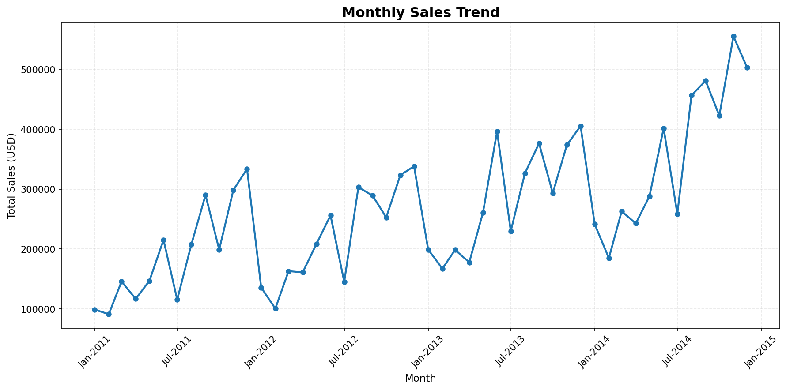
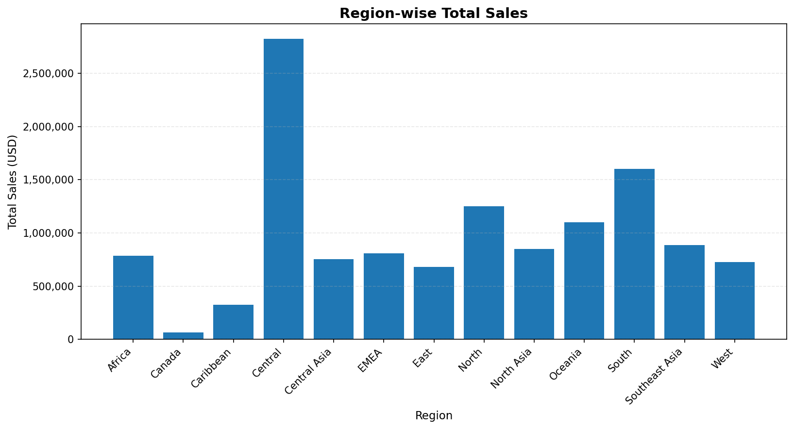
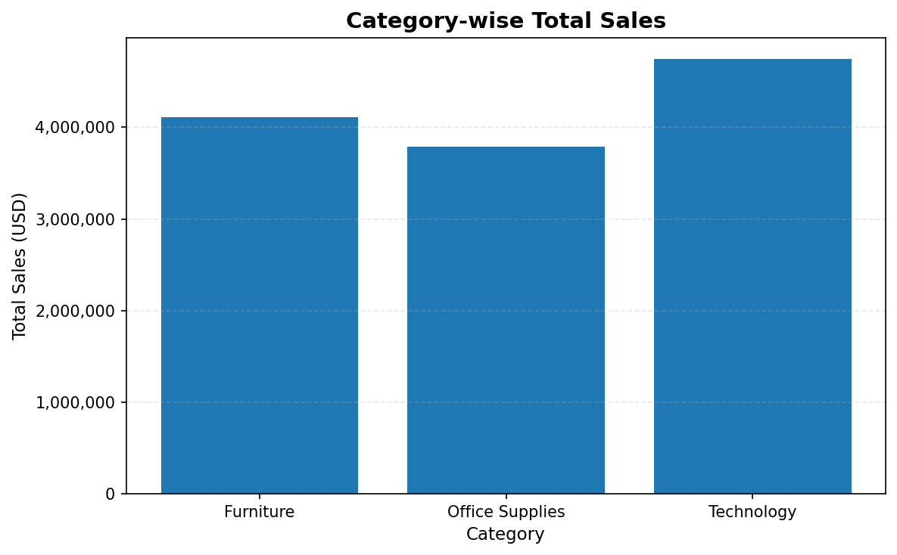
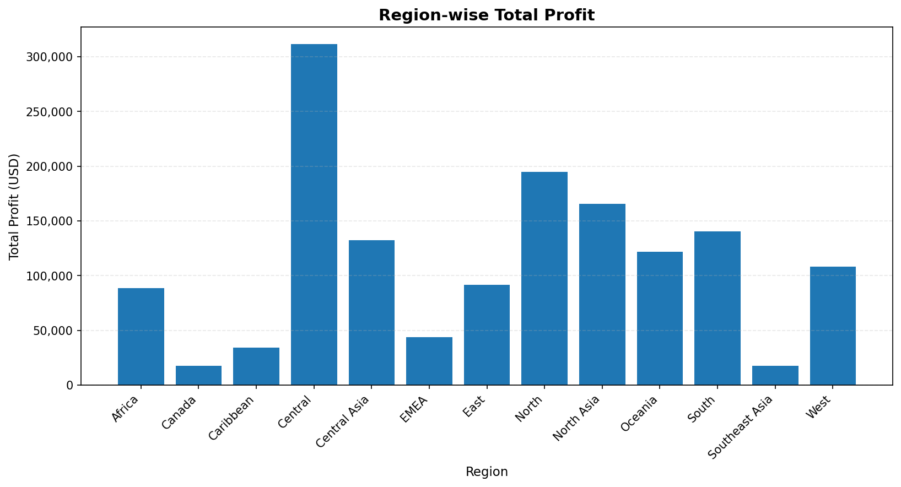
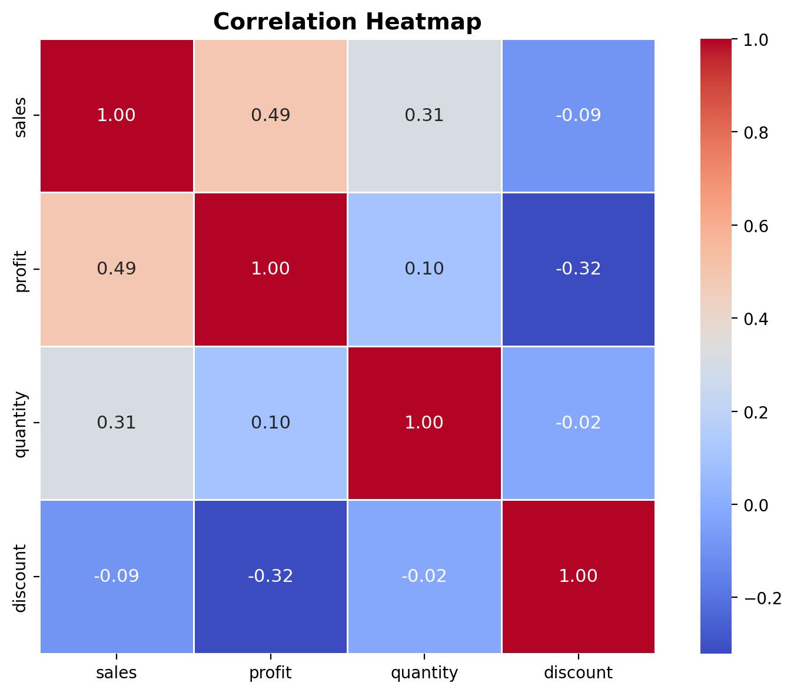

# 📊 Global Superstore Sales & Profit Analysis

## Exploratory Data Analysis (EDA) using Python


---

# 📌 Project Overview

This project presents a comprehensive **Exploratory Data Analysis (EDA)** of the **SuperStoreOrders.csv** dataset using Python.

The objective of this analysis is to transform raw business transaction data into meaningful insights that support data-driven business decision-making. The project explores sales performance, profitability, customer purchasing behavior, regional performance, product categories, shipping methods, discount strategies, and long-term business trends through statistical analysis and professional data visualization.

The analysis follows a complete analytics workflow, including:

- Data Loading
- Data Cleaning
- Exploratory Data Analysis (EDA)
- Correlation Analysis
- Time Series Analysis
- Business Insights
- Strategic Recommendations
- Executive Business Report

This project was completed as part of the **CodeAlpha Data Analytics Internship** while following industry-standard data analysis, visualization, and documentation practices.

---

# 📊 Project Visualizations

### 📈 Monthly Sales Trend



---

### 🌍 Sales by Region



---

### 📊 Sales by Category



---

### 💰 Profit by Region



---

### 🔥 Correlation Heatmap



# 🎯 Project Objectives

The primary objectives of this project were to:

- Analyze overall sales and profit performance across different business dimensions.
- Identify the most profitable and least profitable product categories and sub-categories.
- Examine customer purchasing behavior across different market segments.
- Evaluate regional sales and profitability to identify high-performing and underperforming markets.
- Analyze the impact of discount policies on overall business profitability.
- Study shipping modes and their contribution to sales and profit.
- Explore relationships among key business variables using correlation analysis.
- Investigate monthly sales and profit trends through time-series analysis.
- Generate actionable business insights and strategic recommendations to support data-driven decision-making.

---

# 📂 Dataset Information

### Dataset Summary

| Attribute | Details |
|----------|---------|
| **Dataset Name** | SuperStoreOrders.csv |
| **Records** | 51,290 |
| **Features** | 21 Columns |
| **Project Type** | Exploratory Data Analysis (EDA) |

The dataset contains historical sales transaction records of a global retail business operating across multiple markets and regions.

### Dataset Includes

- Customer Information
- Product Categories & Sub-Categories
- Sales
- Profit
- Quantity
- Discounts
- Shipping Details
- Geographic Information
- Order Dates
- Market & Region Information

The dataset was cleaned and transformed before analysis to ensure accuracy, consistency, and reliability of the results.

---

# 🛠 Tools & Technologies

| Tool | Purpose |
|------|---------|
| **Python** | Data Analysis & Programming |
| **Pandas** | Data Cleaning & Manipulation |
| **NumPy** | Numerical Computing |
| **Matplotlib** | Data Visualization |
| **Seaborn** | Statistical Visualization |
| **Jupyter Notebook** | Interactive Analysis Environment |
| **GitHub** | Project Version Control & Portfolio Showcase |

---

# 🔄 Project Workflow

The project followed a structured data analytics workflow:

```text
Raw Dataset
      │
      ▼
Data Loading
      │
      ▼
Data Cleaning
      │
      ▼
Exploratory Data Analysis (EDA)
      │
      ▼
Correlation Analysis
      │
      ▼
Time Series Analysis
      │
      ▼
Business Insights
      │
      ▼
Strategic Recommendations
      │
      ▼
Executive Business Report
```

---

---

# 📈 Key Business Insights

The analysis uncovered several valuable business insights that can support strategic decision-making.

### 📊 Sales & Profit Performance

- The business demonstrated consistent growth in both **sales** and **profit** from **2011 to 2014**.
- Although sales increased steadily, monthly profit showed greater fluctuations, indicating that higher revenue does not always translate into higher profitability.

---

### 🛍 Product Performance

- A small number of product categories and sub-categories contributed a significant share of total sales and profit.
- Some products generated high sales but relatively low profits, suggesting opportunities to optimize pricing and cost management.

---

### 👥 Customer Analysis

- The **Consumer** segment generated the highest sales and profit, making it the company's most valuable customer group.
- Corporate and Home Office segments also contributed positively and represent opportunities for future business expansion.

---

### 🌍 Regional Analysis

- Business performance varied across different regions.
- Several regions consistently outperformed others in both sales and profitability, highlighting potential best practices that can be replicated elsewhere.

---

### 🚚 Shipping Analysis

- **Standard Class** shipping accounted for the largest share of sales and profit.
- Premium shipping methods contributed comparatively less, indicating that customers generally preferred cost-effective delivery options.

---

### 💰 Discount Analysis

- Discounts exhibited a **negative relationship** with profit.
- Excessive discounting reduced profitability, emphasizing the importance of balanced pricing strategies.

---

### 📉 Correlation Analysis

- Sales and profit showed a **moderate positive correlation**, indicating that increased sales generally contributed to higher profits.
- Discount displayed the strongest negative correlation with profit, reinforcing the findings from the discount analysis.

---

### 📅 Time-Series Analysis

- Monthly sales and profit displayed a clear long-term upward trend.
- Seasonal fluctuations were observed throughout the analysis period.
- Overall business performance reached its highest level during **2014**.
---

---

# 💼 Skills Demonstrated

Through this project, the following data analytics skills were applied:

- Data Cleaning & Preprocessing
- Exploratory Data Analysis (EDA)
- Business Data Visualization
- Statistical Summary & Interpretation
- Correlation Analysis
- Time-Series Analysis
- Business Insight Generation
- Strategic Recommendation Development
- Professional Technical Documentation
- GitHub Project Organization

---

---

# 📁 Project Structure

```text
CodeAlpha_Superstore_EDA/

│
├── data/
│   └── SuperStoreOrders.csv
│
├── images/
│   └── (Project Visualizations)
│
├── notebooks/
│   ├── Superstore_EDA.ipynb
│   ├── Superstore_EDA.html
│   └── Superstore_EDA.pdf
│
└── README.md
```

---

# 🚀 How to Run the Project

To explore this project on your local machine:

### 1️⃣ Clone the Repository

```bash
git clone https://github.com/mohitkumar29239/CodeAlpha_Superstore_EDA.git
```

### 2️⃣ Navigate to the Project Folder

```bash
cd CodeAlpha_Superstore_EDA
```

### 3️⃣ Open the Notebook

Launch **Jupyter Notebook** or **JupyterLab** and open:

```text
notebooks/Superstore_EDA.ipynb
```

### 4️⃣ Install Required Libraries

Install the required Python libraries if they are not already available:

```bash
pip install pandas numpy matplotlib seaborn
```

The project is now ready to run and explore.

---

# 🔮 Future Improvements

Future enhancements that can extend this project include:

- Develop interactive dashboards using **Power BI** or **Tableau**.
- Build predictive models for sales forecasting using Machine Learning.
- Perform customer segmentation using clustering techniques.
- Estimate Customer Lifetime Value (CLV).
- Conduct Market Basket Analysis using Apriori or FP-Growth algorithms.
- Build profit prediction models using regression and machine learning.
- Integrate external business data such as marketing campaigns and economic indicators.
- Automate business reporting using Python.

These improvements would transform this exploratory analysis into a comprehensive business decision-support system.

---

# 👨‍💻 Author

**Mohit Kumar**

- 🎓 M.Sc. Statistics
- 📊 Aspiring Data Analyst
- 🐍 Python | SQL (Learning) | Power BI (Learning)
- 💼 CodeAlpha Data Analytics Intern

---

⭐ If you found this project useful, consider giving the repository a **Star** on GitHub.